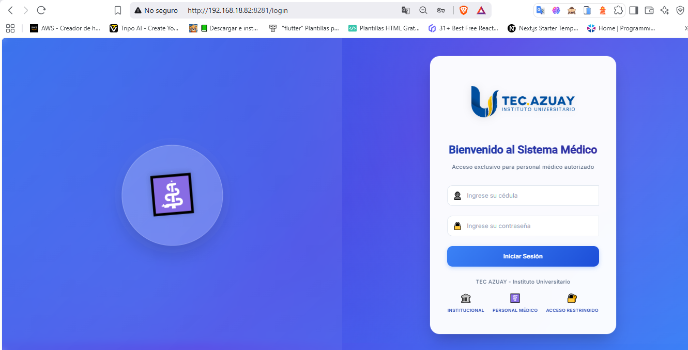
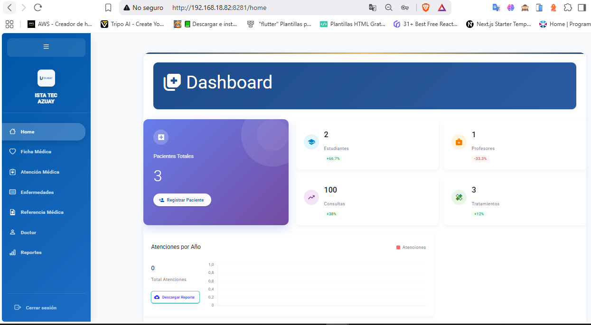
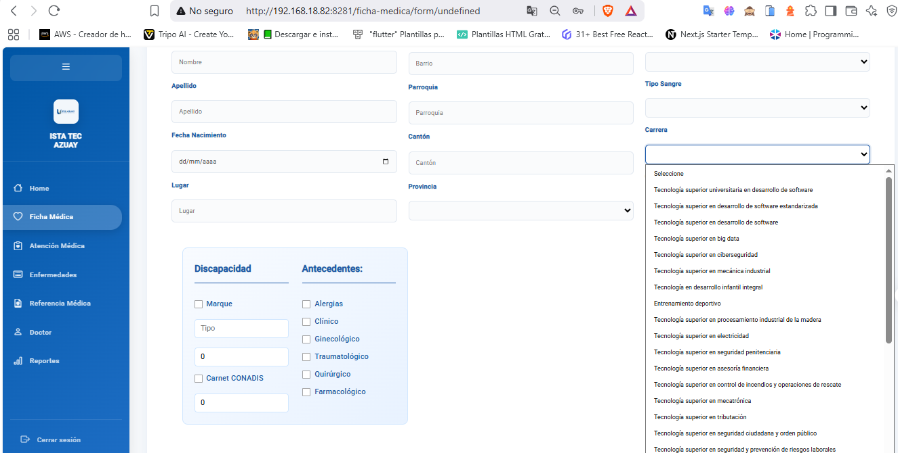
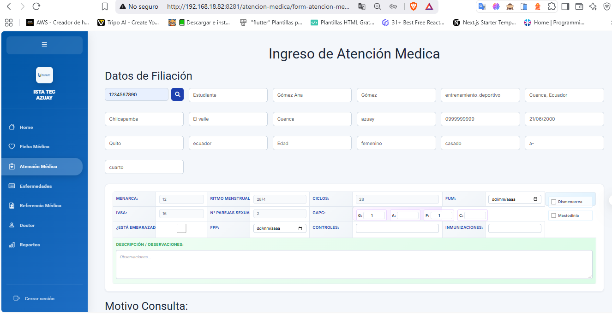
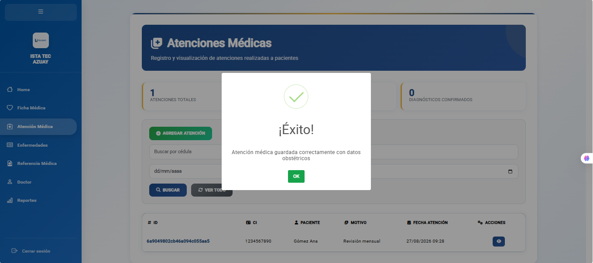
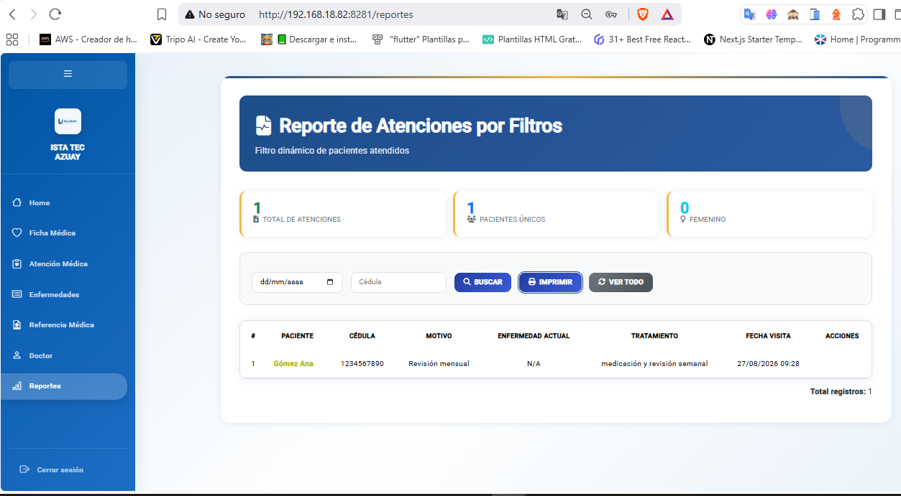

# 💻 TECAZUAY Registros Médicos - Frontend Web

## 📌 Descripción del Proyecto

Aplicación Web cliente para el **Sistema Integrado de Administración de Registros Médicos del TECAZUAY**. Esta plataforma permite al personal médico administrar historias clínicas, gestionar fichas de pacientes y consultar reportes mediante el consumo de la API REST central.

---

## 🛠️ Tecnologías Utilizadas

* **Framework Web:** Angular
* **Lenguaje:** TypeScript
* **Estilos & UI:** CSS3 / HTML5 / Bootstrap
* **Consumo de Servicios:** RxJS / HttpClient
* **Herramientas & Entorno:** Node.js, npm, Angular CLI, Git / GitHub

---

## 🎨 Módulos e Interfaz de Usuario

* **📋 Ficha de Afiliación & Antecedentes:** Formularios reactivos para el registro y consulta de información del paciente y sus antecedentes familiares.
* **🩺 Módulo de Atención Médica:** Captura e historial de signos vitales, diagnósticos y prescripciones.
* **🔍 Buscador CIE-10:** Interfaz de búsqueda para la codificación diagnóstica.
* **📄 Formulario de Referencias:** Generación y visualización de derivaciones médicas.
* **📈 Panel de Analítica:** Reportes dinámicos con filtros por carrera, género y periodos.

---

## 👨‍💻 Mis Contribuciones en el Frontend (Bryan Farez)

* **Vistas de Ficha Médica:** Construcción de los componentes y formularios para Datos de Afiliación y Antecedentes Familiares.
* **Integración API:** Consumo de los servicios RESTful provenientes del Backend en Spring Boot.
* **Pruebas Funcionales (QA):** Ejecución de pruebas integrales para garantizar la usabilidad y correcta validación de datos.

---
## 📸 Capturas de la Interfaz Web

| Autenticación de Usuarios | Panel Principal (Dashboard) |
| :---: | :---: |
|  |  |

| Ficha de Afiliación | Atención Médica / Historial |
| :---: | :---: |
|  |  |

| Diagnóstico y Registro CIE-10 | Módulo de Reportes |
| :---: | :---: |
|  |  |

---
## 🔗 Repositorios del Sistema Integrado

* ⚙️ **Backend API:** [HistorialClinico](https://github.com/Bfarez21/HistorialClinico)
* 💻 **Frontend Web:** [TFC-Fronted-M4A](https://github.com/Bfarez21/TFC-Fronted-M4A)
* 📱 **App Móvil:** [HistorialClinicoTFC4](https://github.com/Bfarez21/HistorialClinicoTFC4)
